# Quests

## Sprint 1

### Quest: Where is this first aid kit located?

#### Issue

#6457

#### Quest folder

`quests/first_aid_kit/`

#### Overpass turbo query

```
node["emergency"="first_aid_kit"][!description][!"first_aid_kit:description"]["access"!~"no|private"]({{bbox}});
out geom meta;
```

#### Test location

GANAYE IN STOCK, Rue Vaucanson, Martigues

Coordinates: 43.3953386 / 5.0352321 (lat/lon)

#### Test result

**Successful**

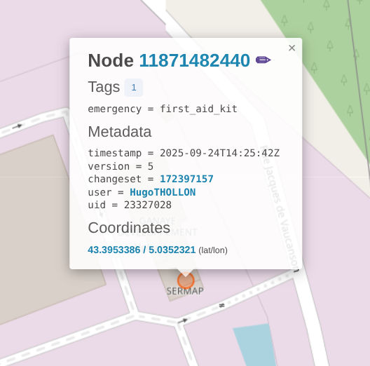

_OpenStreetMap node before the quest completion_

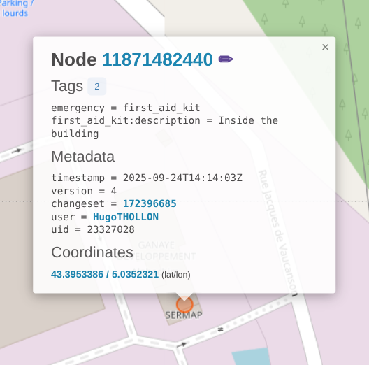

_OpenStreetMap node after the quest completion_

The changes have been rollbacked because we do not possess enough informations on the place to be sure of the information we gave.

In what direction can you ride this? Can you use this lift in both directions?

#### Issue:

#6457

#### Quest folder

`quests/aerialBothWay/`

#### Overpass turbo query

```
way["aerialway"][aerialway!~"cable_car|zipline"][!oneway]({{bbox}});
out geom meta;
```

#### Test location

Lac de Sames, France.

#### Test result

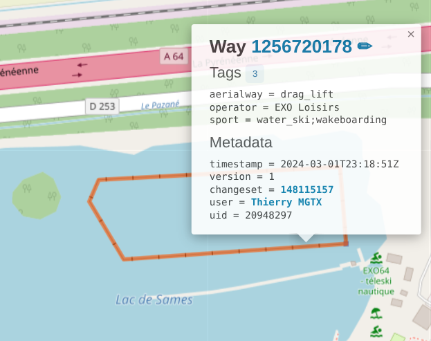

_OpenStreetMap way before the quest completion_

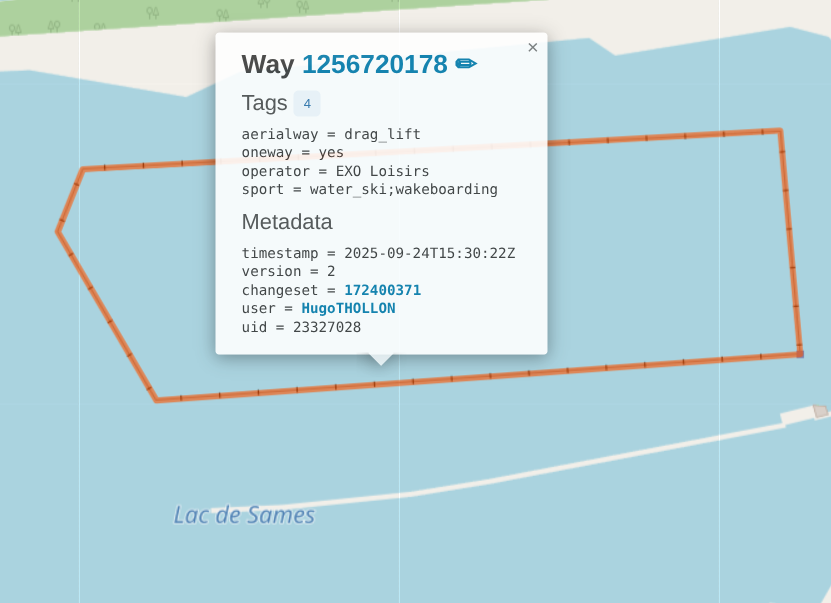

_OpenStreetMap way after the quest completion_

---

### Quest: How many bikes can be charged here at the same time?

#### Issue

#6457

#### Quest folder

`quests/bike_charging_station_capacity/`

#### Overpass turbo query

```
nw["amenity"="charging_station"][!capacity]["bicycle"="yes"]({{bbox}});
out geom meta;
```

#### Test location

Lac de la Ramée, Chemin Anne Caroline Chausson

#### Test result

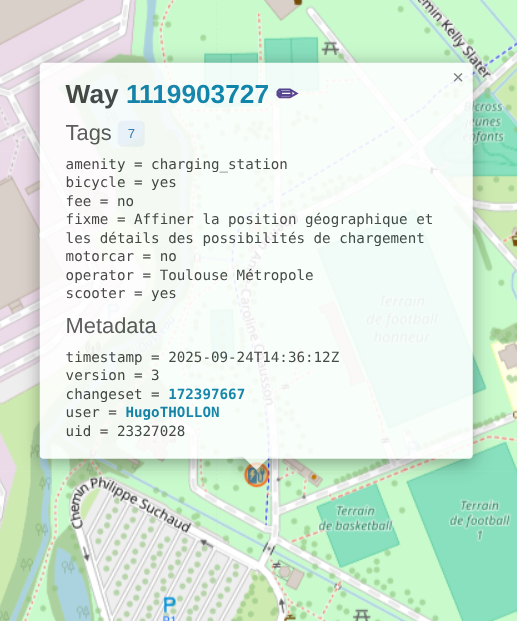

_OpenStreetMap node before the quest completion_

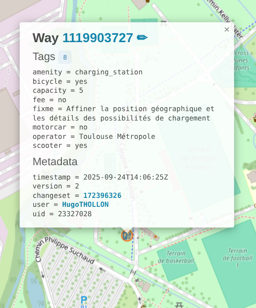

_OpenStreetMap node after the quest completion_

The changes have been rollbacked because we do not possess enough informations on the place to be sure of the information we gave.

---

### Quest: How many scooters can be charged here at the same time?

#### Issue

#6457

#### Quest folder

`quests/scooter_charging_station_capacity/`

#### Overpass turbo query

```
nwr["amenity"="charging_station"][scooter~"yes|designated"][access!~ "private|no"][!capacity]({{bbox}});
out geom meta;
```

#### Test location

Coordinates: 41.3529202 / 2.0887408 (lat/lon)

Carrer de Baltasar Orio i Mercer

#### Test result

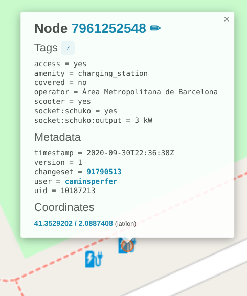

_OpenStreetMap node before the quest completion_

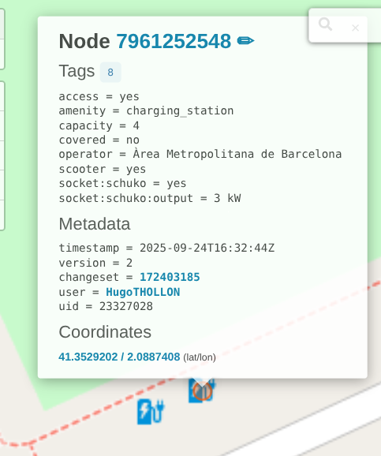

_OpenStreetMap node after the quest completion_

---

### Quest: Do you have to pay to park your motorcycle here?

#### Issue

#6457

#### Quest folder

`quests/parking_fee/`

#### Overpass turbo query

```
nwr["amenity"="motorcycle_parking"][access~"yes|customers|public"][!fee][!"fee:conditional"]({{bbox}});
out geom meta;
```

#### Test location

Rue de la charité, Toulouse

#### Test result

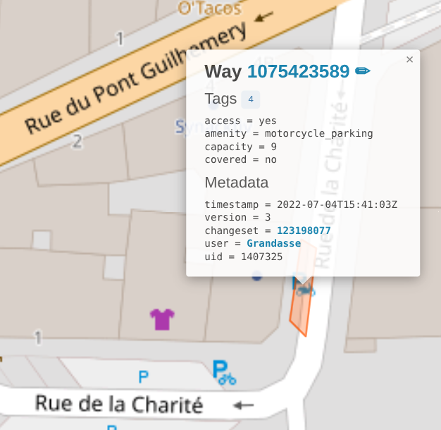

_OpenStreetMap way before the quest completion_

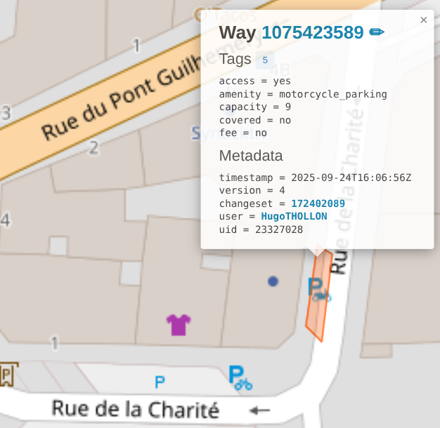

_OpenStreetMap way after the quest completion_

The changes have been rollbacked because we do not possess enough informations on the place to be sure of the information we gave.

---

### Quest: Does this aerialway transport bikes?

#### Issue

#6457

#### Quest folder

`quests/aerialway/`

#### Overpass turbo query

```
way["aerialway"~"cable_car|gondola|chair_lift"][!"aerialway:bicycle"][!"bicycle"]({{bbox}});
out geom meta;
```

#### Test location

Chemin: Taillas
Chemin: Chatégré

#### Test result

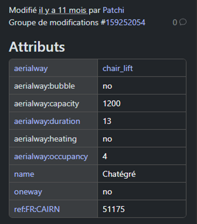

_OpenStreetMap way before the quest completion_

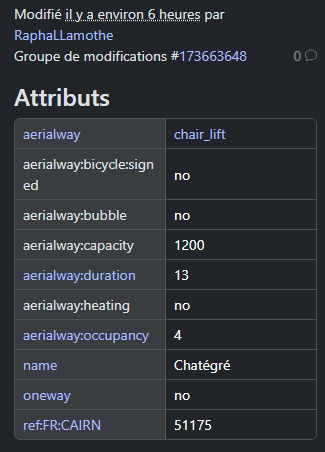

_OpenStreetMap way after the quest completion_

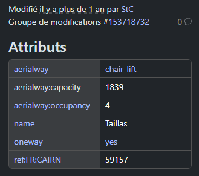

_OpenStreetMap way before the quest completion with the "no_signed" answer_

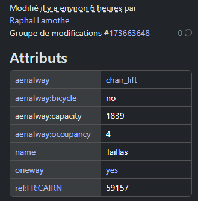

_OpenStreetMap way after the quest completion with the "no_signed" answer_

The changes have been rollbacked because we do not possess enough informations on the place to be sure of the information we gave.

## Sprint 2

### Quest: Who may access this tower?

#### Issue

#6502

#### Quest folder

`quests/tower_access/`

#### Overpass turbo query

```
[out:json][timeout:25];
// gather results
nwr["man_made"="tower"]["tower:type"="observation"][!military][!access]["disused"!="yes"]["historic"="yes"]({{bbox}});
// print results
out geom;
```

#### Test location

Parc de les Valls d'Ax, Espagne.

#### Test result

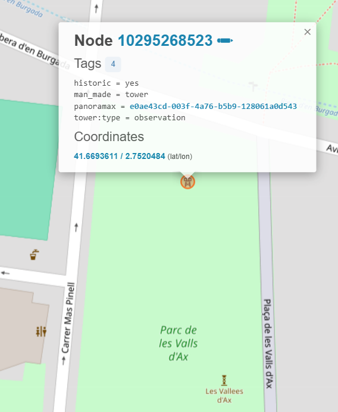

_OpenStreetMap way before the quest completion_

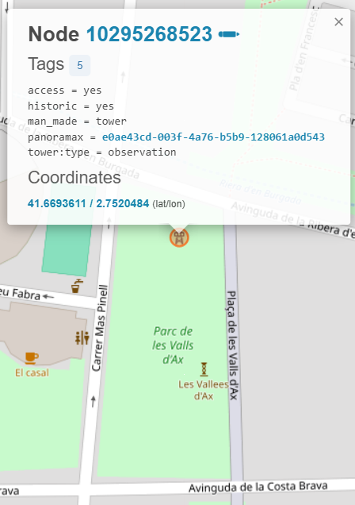

_OpenStreetMap way after the quest completion_

---

### Quest: Is firewood provided here?

#### Issue

#6517

#### Quest folder

`quests/firewood/`

#### Overpass turbo query

```
[out:json][timeout:25];
// gather results
(
  nwr["leisure"="firepit"][!"wood_provided"]["access"!~"no|private"]({{bbox}});

  nwr["amenity"="bbq"]["fuel"="wood"][!"wood_provided"]["access"!~"no|private"]({{bbox}});

  nwr["tourism"="wilderness_hut"]["fireplace"="yes"][!"wood_provided"]["access"!~"no|private"]({{bbox}});
);
// print results
out geom;
```

#### Test location

Gazebo, États-Unis (Californie).

#### Test result

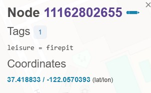

_OpenStreetMap way before the quest completion_

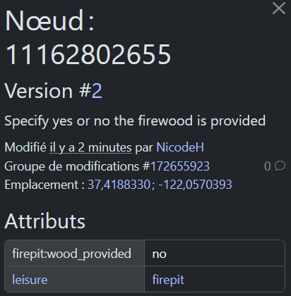

_OpenStreetMap way after the quest completion_

---

### Quest: Is this lock self_service?

#### Issue

#6540

#### Quest folder

`quests/boat_lock_self_service/`

#### Overpass turbo query

```
way["lock"="yes"][!self_service]({{bbox}});
out geom meta;
```

#### Test location

Écluse de Lalande

#### Test result

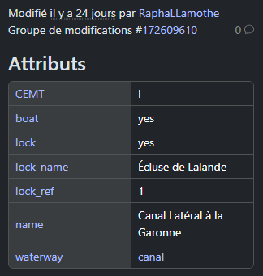

_OpenStreetMap way before the quest completion_

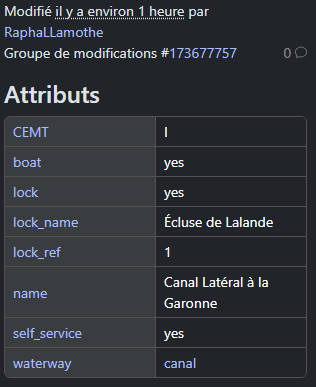

_OpenStreetMap way after the quest completion_

The changes have been rollbacked because we do not possess enough informations on the place to be sure of the information we gave.

## Sprint 3

### Quest: What's the topic of this information board? ("Rules" option added)

#### Issue

#6147

#### Quest folder

`quests/board_type/`

#### Overpass turbo query

```
[out:json][timeout:25];
// gather results
nwr["tourism"="information"]["information"="board"]({{bbox}});
// print results
out geom;
```

#### Test location

Frouzins, France.

#### Test result

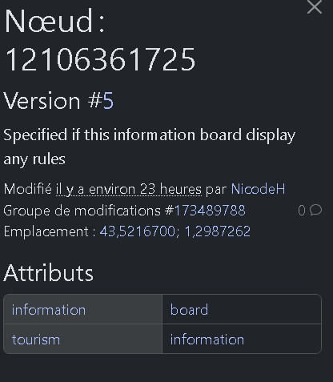

_OpenStreetMap way before the quest completion_

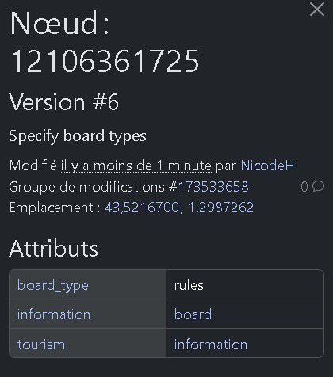

_OpenStreetMap way after the quest completion_

---

### Quest: Is there hot water here?

#### Issue

#6548

#### Quest folder

`quests/hot_water/`

#### Overpass turbo query

```
way["amenity"="shower"]["fee"="no"][!"hot_water"][!"shower:hot_water"]({{bbox}});
out geom meta;
```

#### Test location

43.173917, 3.1857722

#### Test result

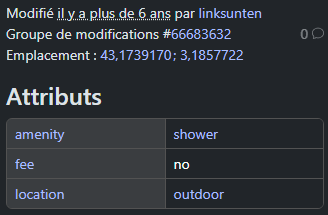

_OpenStreetMap way before the quest completion_

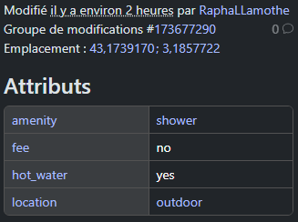

_OpenStreetMap way after the quest completion_

The changes have been rollbacked because we do not possess enough informations on the place to be sure of the information we gave.

---

### Quest: Is this a monument or a memorial?

#### Issue

#6042

#### Quest folder

`quests/monument_memorial_name/`

#### Overpass turbo query

```
nwr["historic"="monument"][!name][noname!=yes]({{bbox}});
out geom;
```

#### Test location

43.8278354, 1.295778 (lat, lon)

Grisolles, France

#### Test result

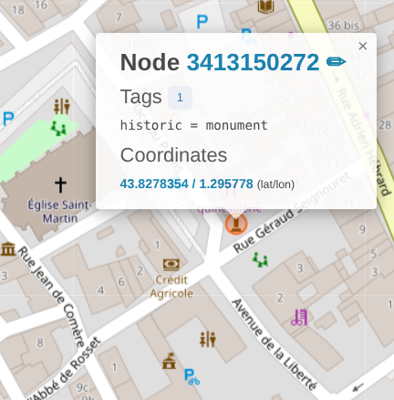

_OpenStreetMap node before the quest completion_

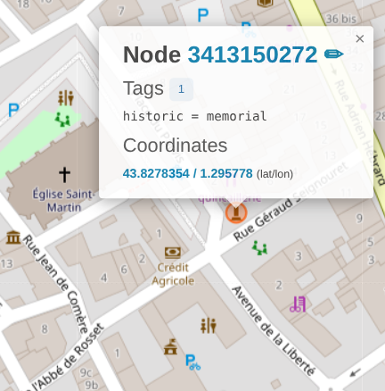

_OpenStreetMap node after the quest completion_

---

### Quest: What's the name of this monument?

#### Issue

#6042

#### Quest folder

`quests/monument_memorial_name/`

#### Overpass turbo query

```
nwr["historic"="monument"][!name][noname!=yes]({{bbox}});
out geom;
```

#### Test location

43.8281442, 1.2995449 (lat, lon)

Grisolles, France

#### Test result

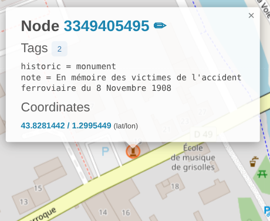

_OpenStreetMap node before the quest completion_

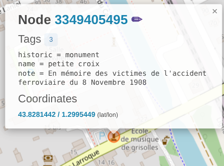

_OpenStreetMap node after adding a name_

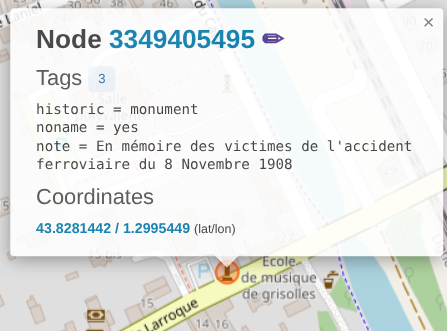

_OpenStreetMap node after adding that there is no name_

The changes have been rollbacked because this node will be used for further testing.
