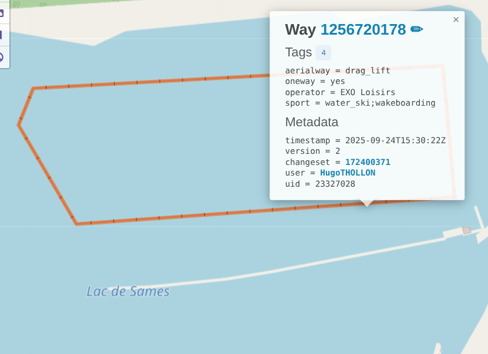
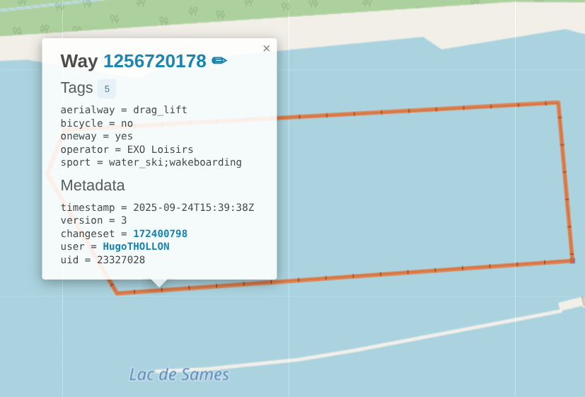

# Quests

## Where is this first aid kit located?

### Issue

#6457

### Quest folder

`quests/first_aid_kit/`

### Overpass turbo query

```
node["emergency"="first_aid_kit"][!description][!"first_aid_kit:description"]["access"!~"no|private"]({{bbox}});
out geom meta;
```

### Test location

GANAYE IN STOCK, Rue Vaucanson, Martigues

Coordinates: 43.3953386 / 5.0352321 (lat/lon)

### Test result

**Successful**


_OpenStreetMap node before the quest completion_


_OpenStreetMap node after the quest completion_

The changes have been rollbacked because we do not possess enough informations on the place to be sure of the information we gave.

## In what direction can you ride this? Can you use this lift in both directions?

### Issue:

#6457

### Quest folder

`quests/bothway/`

### Overpass turbo query

```
way["aerialway"][aerialway!~"cable_car|zipline"][!oneway]({{bbox}});
out geom meta;
```

### Test location

Lac de Sames, France.

### Test result


_OpenStreetMap way before the quest completion_


_OpenStreetMap way after the quest completion_

## How many bikes can be charged here at the same time?

### Issue

#6457

### Quest folder

`quests/bike_charging_station_capacity/`

### Overpass turbo query

```
nw["amenity"="charging_station"][!capacity]["bicycle"="yes"]({{bbox}});
out geom meta;
```

### Test location

Lac de la Ramée, Chemin Anne Caroline Chausson

### Test result


_OpenStreetMap node before the quest completion_


_OpenStreetMap node after the quest completion_

The changes have been rollbacked because we do not possess enough informations on the place to be sure of the information we gave.

## How many scooters can be charged here at the same time?

### Issue

#6457

### Quest folder

`quests/scooter_charging_station_capacity/`

### Overpass turbo query

```
nwr["amenity"="charging_station"][scooter~"yes|designated"][access!~ "private|no"][!capacity]({{bbox}});
out geom meta;
```

### Test location

Coordinates: 41.3529202 / 2.0887408 (lat/lon)

Carrer de Baltasar Orio i Mercer

### Test result


_OpenStreetMap node before the quest completion_


_OpenStreetMap node after the quest completion_

## Do you have to pay to park your motorcycle here?

### Issue

#6457

### Quest folder

`quests/parking_fee/`

### Overpass turbo query

```
nwr["amenity"="motorcycle_parking"][access~"yes|customers|public"][!fee][!"fee:conditional"]({{bbox}});
out geom meta;
```

### Test location

Rue de la charité, Toulouse

### Test result


_OpenStreetMap way before the quest completion_


_OpenStreetMap way after the quest completion_

The changes have been rollbacked because we do not possess enough informations on the place to be sure of the information we gave.

## Does this aerialway transport bikes?

### Issue

#6457

### Quest folder

`quests/aerialway/`

### Overpass turbo query

```
way["aerialway"][!bicycle]({{bbox}});
out geom meta;
```

### Test location

Lac de Sames, France.

### Test result


_OpenStreetMap way before the quest completion_


_OpenStreetMap way after the quest completion_

## Who may access this tower?

### Issue

#6502

### Quest folder

`quests/tower_access/`

### Overpass turbo query

```
[out:json][timeout:25];
// gather results
nwr["man_made"="tower"]["tower:type"="observation"][!military][!access]["disused"!="yes"]["historic"="yes"]({{bbox}});
// print results
out geom;
```

### Test location

Parc de les Valls d'Ax, Espagne.

### Test result


_OpenStreetMap way before the quest completion_


_OpenStreetMap way after the quest completion_
